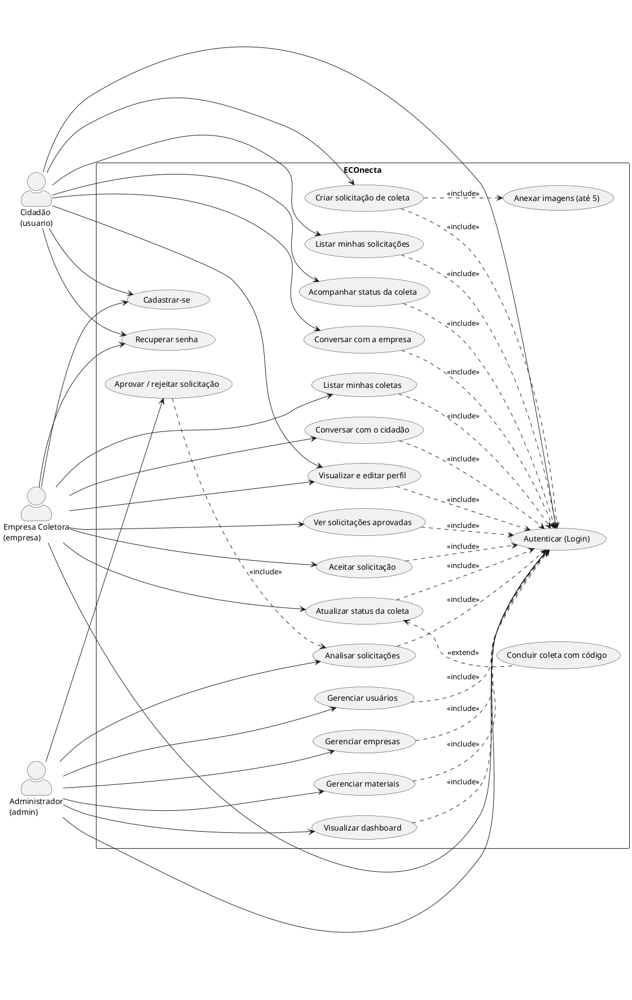
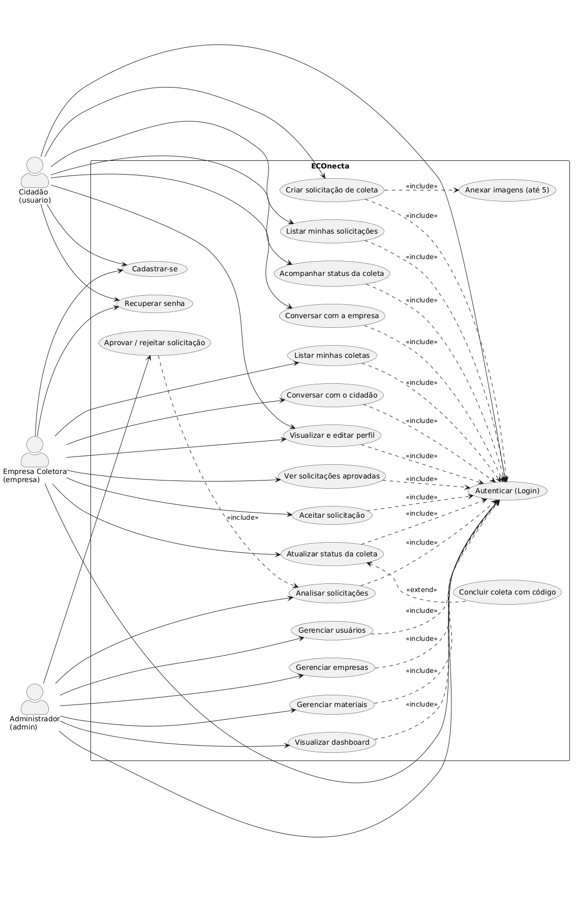

# APÊNDICE A — Diagrama de Casos de Uso

Diagrama de casos de uso do sistema **ECOnecta**, com os três atores (Cidadão, Empresa Coletora e
Administrador) e o caso de uso de autenticação compartilhado via `<<include>>`.

> Cole o bloco abaixo em <https://www.plantuml.com/plantuml/uml> ou use a extensão *PlantUML* no VS Code.

### Imagem renderizada

## Resumo dos casos de uso

| ID | Caso de uso | Ator(es) |
|----|-------------|----------|
| UC01 | Cadastrar-se (como cidadão ou empresa) | Cidadão, Empresa |
| UC02 | Autenticar (Login) | Todos |
| UC03 | Recuperar senha | Cidadão, Empresa |
| UC04 | Visualizar e editar perfil | Cidadão, Empresa |
| UC05 | Criar solicitação de coleta | Cidadão |
| UC06 | Anexar imagens (até 5) | Cidadão |
| UC07 | Listar minhas solicitações | Cidadão |
| UC08 | Acompanhar status da coleta | Cidadão |
| UC09 | Conversar com a empresa | Cidadão |
| UC10 | Ver solicitações aprovadas disponíveis | Empresa |
| UC11 | Aceitar solicitação | Empresa |
| UC12 | Listar minhas coletas | Empresa |
| UC13 | Atualizar status da coleta | Empresa |
| UC14 | Concluir coleta com código de confirmação | Empresa |
| UC15 | Conversar com o cidadão | Empresa |
| UC16 | Visualizar dashboard | Administrador |
| UC17 | Analisar solicitações | Administrador |
| UC18 | Aprovar / rejeitar solicitação | Administrador |
| UC19 | Gerenciar usuários | Administrador |
| UC20 | Gerenciar empresas | Administrador |
| UC21 | Gerenciar materiais | Administrador |
