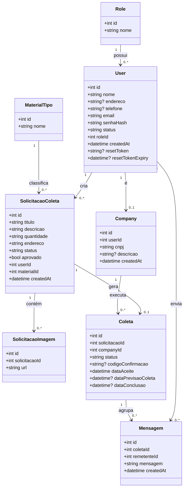
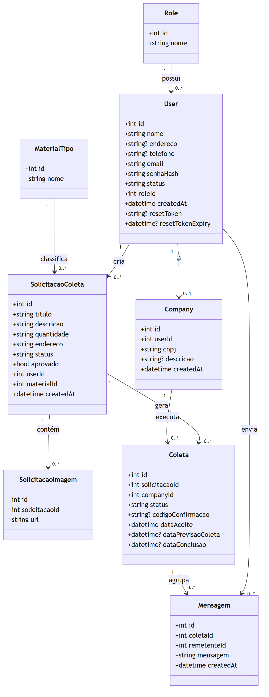

# APÊNDICE C — Diagrama de Classes de Dados

Diagrama de classes de dados do **ECOnecta**, derivado do modelo Prisma (`prisma/schema.prisma`).
Apresenta os atributos, tipos e as multiplicidades dos relacionamentos.

> Cole o bloco abaixo em <https://mermaid.live> ou visualize direto no GitHub/VS Code.

### Imagem renderizada

## Multiplicidades

| Origem | Destino | Cardinalidade | Observação |
|--------|---------|---------------|------------|
| Role | User | 1 : N | Cada usuário tem exatamente uma role |
| User | Company | 1 : 0..1 | Apenas usuários do tipo empresa possuem `Company` (`userId` único) |
| User | SolicitacaoColeta | 1 : N | Solicitações criadas pelo cidadão |
| User | Mensagem | 1 : N | Mensagens enviadas (remetente) |
| MaterialTipo | SolicitacaoColeta | 1 : N | Tipo de material da solicitação |
| SolicitacaoColeta | SolicitacaoImagem | 1 : N | Até 5 imagens por solicitação (regra de negócio) |
| SolicitacaoColeta | Coleta | 1 : 0..1 | Uma solicitação gera no máximo uma coleta (`solicitacaoId` único) |
| Company | Coleta | 1 : N | Coletas executadas pela empresa |
| Coleta | Mensagem | 1 : N | Conversa vinculada à coleta |
