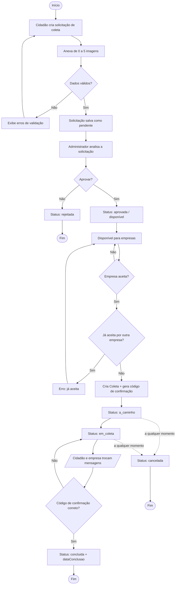
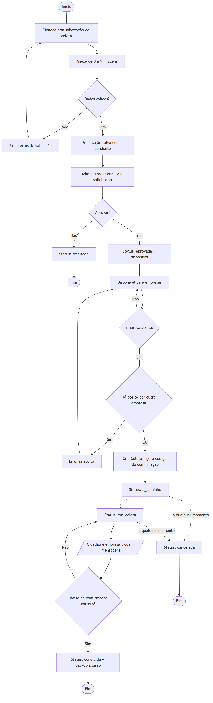

# APÊNDICE D — Diagrama de Atividades

Diagrama de atividades do fluxo principal do **ECOnecta**: da criação da solicitação pelo cidadão,
passando pela moderação do administrador, até a execução e conclusão da coleta pela empresa.

> Cole o bloco abaixo em <https://mermaid.live> ou visualize direto no GitHub/VS Code.

### Imagem renderizada

## Observações sobre o fluxo

- A **validação** dos dados ocorre tanto no cliente quanto no servidor (Zod).
- A solicitação só fica visível para empresas quando `status = aprovada` **e** ainda não possui coleta.
- O **código de confirmação** é gerado no aceite e fica visível para o cidadão; a empresa precisa
  informá-lo para concluir a coleta.
- O status `cancelada` pode ser atingido a partir de qualquer etapa em andamento da coleta.
