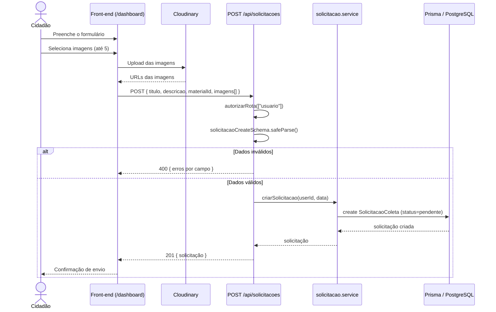
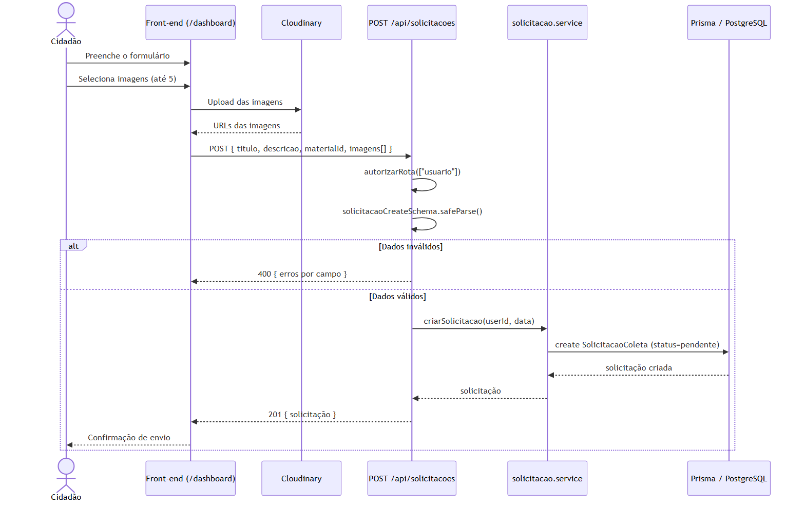
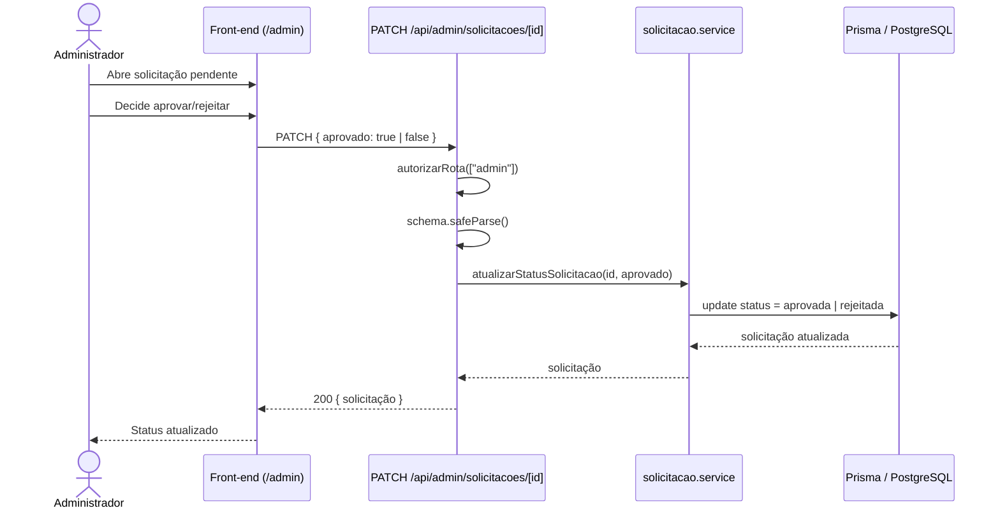
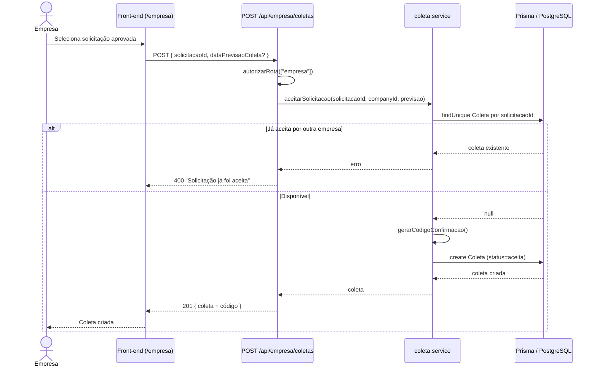
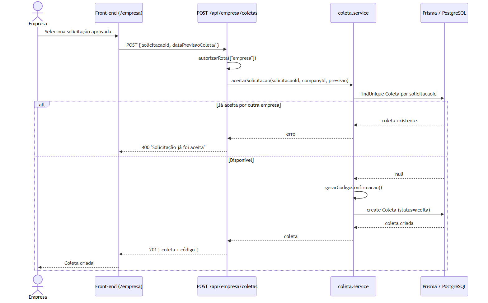
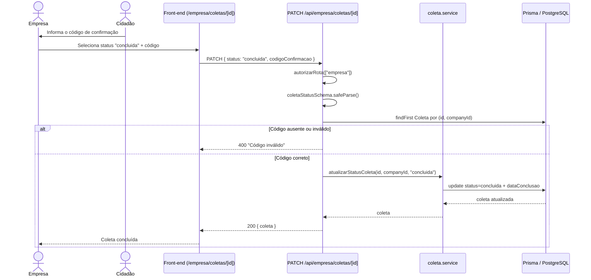
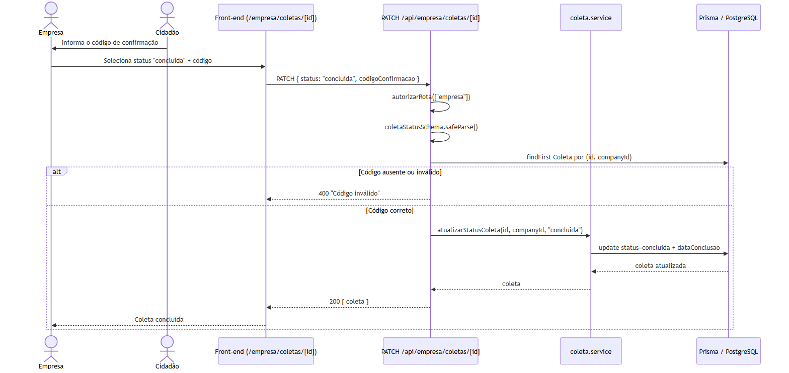
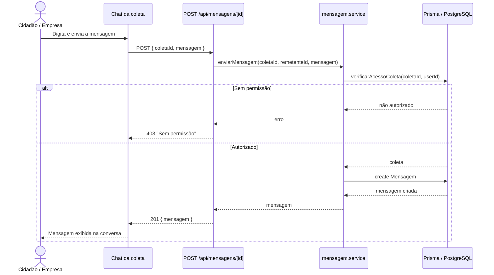
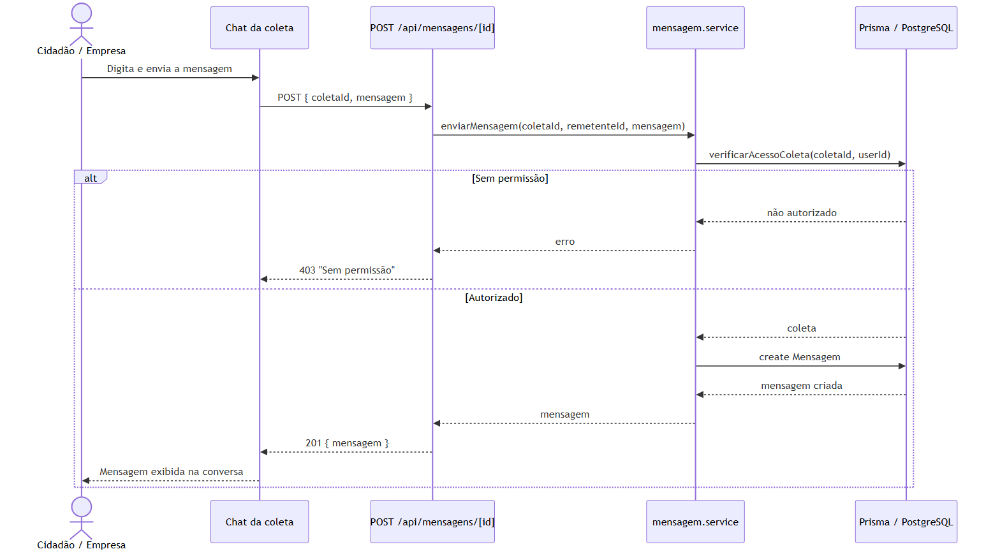

# APÊNDICE E — Diagrama de Sequência

Diagramas de sequência dos fluxos centrais do **ECOnecta**. Os participantes refletem a arquitetura
real: navegador → rotas de API (Next.js) → camada de serviço → Prisma/PostgreSQL.

> Cole cada bloco em <https://mermaid.live> ou visualize direto no GitHub/VS Code.

---

## E.1 — Criar solicitação de coleta (Cidadão)

---

## E.2 — Aprovar / rejeitar solicitação (Administrador)

---

## E.3 — Aceitar solicitação (Empresa)

---

## E.4 — Concluir coleta com código de confirmação (Empresa)

---

## E.5 — Enviar mensagem no chat da coleta

