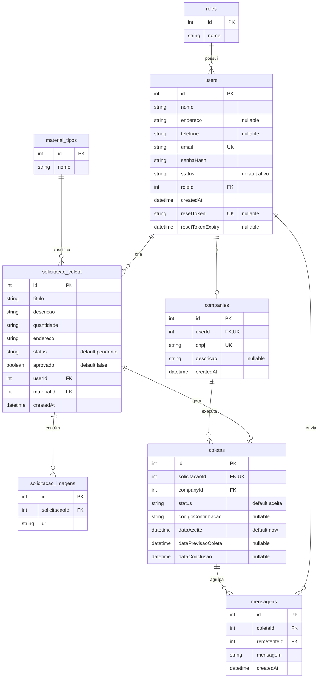
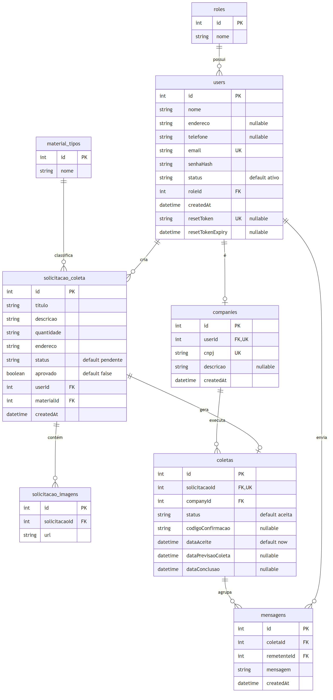

# APÊNDICE F — Diagrama de Entidade e Relacionamento (DER)

Modelo entidade-relacionamento do **ECOnecta**, correspondente às tabelas físicas em PostgreSQL
(nomes de tabela conforme `@@map` no `prisma/schema.prisma`).

> Cole o bloco abaixo em <https://mermaid.live> ou visualize direto no GitHub/VS Code.

### Imagem renderizada

## Legenda

- **PK** — chave primária
- **FK** — chave estrangeira
- **UK** — chave única (unique)
- `||--o{` — relacionamento um-para-muitos (1:N)
- `||--o|` — relacionamento um-para-zero-ou-um (1:0..1)

## Chaves e restrições principais

| Tabela | Restrição | Descrição |
|--------|-----------|-----------|
| `users` | `email` UNIQUE | E-mail único por usuário |
| `users` | `resetToken` UNIQUE | Token de redefinição de senha único |
| `companies` | `userId` UNIQUE | Relação 1:1 com `users` |
| `companies` | `cnpj` UNIQUE | CNPJ único por empresa |
| `coletas` | `solicitacaoId` UNIQUE | Uma solicitação gera no máximo uma coleta |
