# APÊNDICE H — Diagramas de Classes Participantes

Diagramas de classes participantes (análise de robustez) dos principais casos de uso do **ECOnecta**.
Cada diagrama organiza as classes em três estereótipos:

- **«boundary»** (fronteira) — telas e rotas de API que fazem a interface com o ator;
- **«control»** (controle) — regras de negócio (camada de serviço / validação);
- **«entity»** (entidade) — dados persistidos (modelos Prisma).

> Cole cada bloco em <https://mermaid.live> ou visualize direto no GitHub/VS Code.

---

## H.1 — Criar solicitação de coleta (UC05)

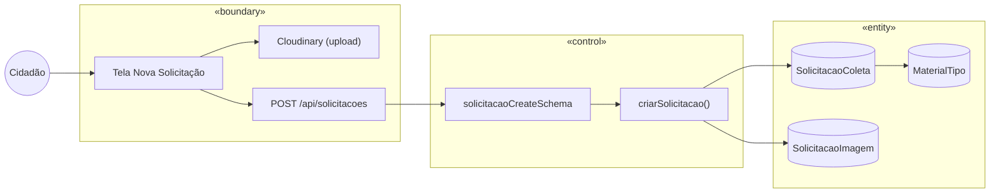

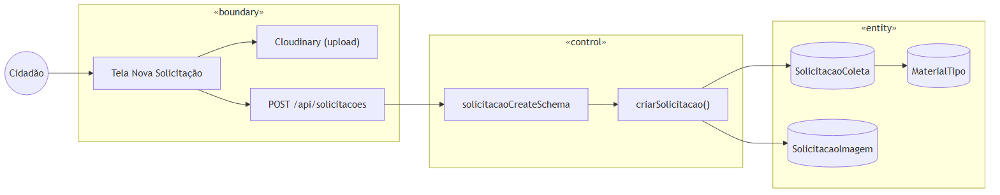

---

## H.2 — Aprovar / rejeitar solicitação (UC17/UC18)

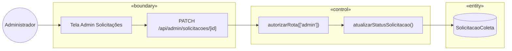

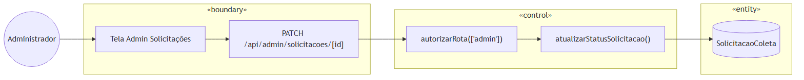

---

## H.3 — Aceitar solicitação (UC11)

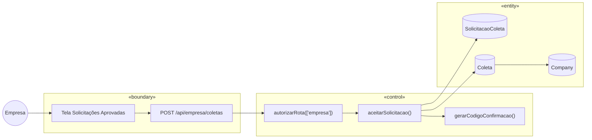

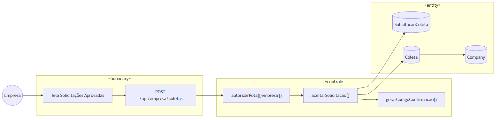

---

## H.4 — Atualizar / concluir coleta (UC13/UC14)

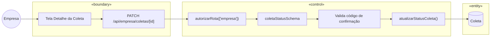

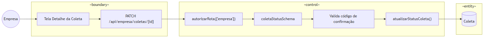

---

## H.5 — Enviar mensagem no chat (UC09/UC15)

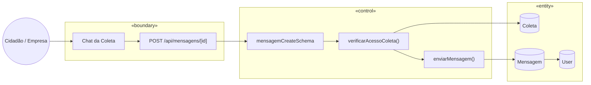

---

## H.6 — Autenticar (UC02)

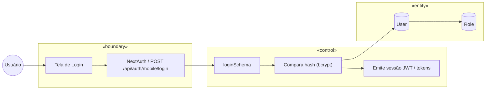

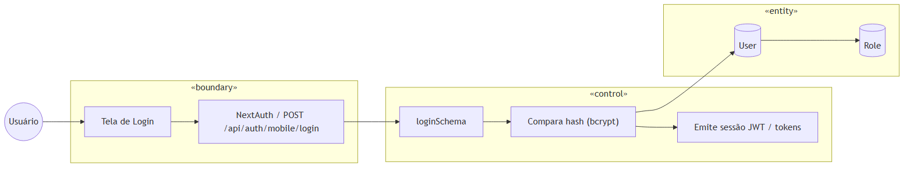
