# Documentação UML — ECOnecta

> Plataforma para conectar **cidadãos**, **administradores** e **empresas coletoras** no processo de solicitação e coleta de materiais recicláveis.
>
> Documento gerado a partir da análise direta do código-fonte (engenharia reversa). Itens que não estão explícitos no código estão marcados como **[inferido]** ou **[não identificado]**.

---

## Sumário

1. [Resumo Executivo](#1-resumo-executivo)
2. [Visão Geral do Sistema](#2-visão-geral-do-sistema)
3. [Escopo do Sistema](#3-escopo-do-sistema)
4. [Atores do Sistema](#4-atores-do-sistema)
5. [Requisitos Funcionais](#5-requisitos-funcionais)
6. [Regras de Negócio](#6-regras-de-negócio)
7. [Diagrama de Casos de Uso](#7-diagrama-de-casos-de-uso)
8. [Diagrama de Classes](#8-diagrama-de-classes)
9. [Diagrama de Entidades / Modelo de Domínio](#9-diagrama-de-entidades--modelo-de-domínio)
10. [Diagramas de Sequência](#10-diagramas-de-sequência)
11. [Diagramas de Atividades](#11-diagramas-de-atividades)
12. [Diagramas de Estados](#12-diagramas-de-estados)
13. [Diagrama de Componentes](#13-diagrama-de-componentes)
14. [Diagrama de Pacotes](#14-diagrama-de-pacotes)
15. [Diagrama de Implantação / Deploy](#15-diagrama-de-implantação--deploy)
16. [Documentação de Rotas e Endpoints](#16-documentação-de-rotas-e-endpoints)
17. [Documentação das Telas](#17-documentação-das-telas)
18. [Análise de Qualidade da Arquitetura](#18-análise-de-qualidade-da-arquitetura)
19. [Sugestões de Melhoria](#19-sugestões-de-melhoria)
20. [Base do conteúdo: código vs. inferência](#20-base-do-conteúdo-código-vs-inferência)

> A **Matriz de Rastreabilidade** e o **Glossário** estão em arquivos separados:
> [`matriz-rastreabilidade.md`](matriz-rastreabilidade.md) · [`glossario.md`](glossario.md)

---

## 1. Resumo Executivo

**ECOnecta** (nome de pacote: `recycling-system`) é uma plataforma full-stack de economia circular que intermedia a **doação/coleta de materiais recicláveis** entre três perfis: o **cidadão** que possui o material, a **empresa coletora** que executa a coleta, e o **administrador** que modera a plataforma.

O fluxo central é: o cidadão **cria uma solicitação** (com material, quantidade, endereço e até 5 imagens) → o administrador **aprova ou rejeita** → a solicitação aprovada fica **disponível** no marketplace para empresas → uma empresa **aceita** (gerando uma *Coleta*) → a empresa **atualiza o andamento** (`aceita → a_caminho → em_coleta → concluida`) → após a conclusão, o cidadão **avalia** a empresa (1 a 5 estrelas). Comunicação por **chat** existe em dois momentos: antes do aceite (chat de negociação por solicitação) e durante a coleta (chat vinculado à coleta). Há **notificações em tempo real** via Server-Sent Events.

| Item | Valor |
|------|-------|
| Tipo de aplicação | Web full-stack (SSR + API) + app mobile (Expo) — monorepo |
| Framework web | Next.js 15.5 (App Router) + React 19 |
| Linguagem | TypeScript |
| Estilo | Tailwind CSS 3.4 |
| ORM / Banco | Prisma 5.22 / PostgreSQL |
| Autenticação web | NextAuth 4.24 (Credentials + JWT) |
| Autenticação mobile | JWT próprio (`jose`, HS256) — access + refresh token |
| Validação | Zod 3 (compartilhado em `packages/shared`) |
| Upload de imagens | Cloudinary (`next-cloudinary`) |
| Mapa / geocoding | Leaflet + ViaCEP |
| Mobile | Expo / React Native (`apps/mobile`) |
| Tempo real | Server-Sent Events (`/api/notificacoes/stream`) |
| Deploy | **[inferido]** Vercel (web) + Postgres gerenciado (Neon — sugerido pela connection string do README) |

---

## 2. Visão Geral do Sistema

### 2.1 Problema resolvido
Materiais recicláveis domésticos frequentemente vão para o lixo comum por falta de um canal simples que conecte quem tem o material a quem faz a coleta. O ECOnecta cria esse canal, com **moderação** (para evitar solicitações inválidas) e **rastreabilidade** do andamento da coleta.

### 2.2 Público-alvo e usuários principais
- **Cidadãos** (`role = usuario`): pessoas físicas com material reciclável.
- **Empresas coletoras** (`role = empresa`): organizações que recolhem e processam recicláveis.
- **Administradores** (`role = admin`): equipe da plataforma que modera e gerencia o catálogo.

### 2.3 Principais funcionalidades (confirmadas no código)
- Cadastro e login (cidadão e empresa) — `src/app/api/auth/*`
- Recuperação de senha por token — `forgot-password` / `reset-password`
- Criação de solicitações com upload de até 5 imagens (Cloudinary) — `solicitacao.service.ts`
- Moderação (aprovar/rejeitar) pelo admin — `atualizarStatusSolicitacao`
- Marketplace de solicitações disponíveis para empresas — `listarSolicitacoesAprovadas`
- Aceite de coleta com transação atômica + código de confirmação — `aceitarSolicitacao`
- Atualização de status da coleta — `atualizarStatusColeta`
- Chat de negociação pré-aceite (por empresa) — `conversa-solicitacao.service.ts`
- Chat operacional durante a coleta — `mensagem.service.ts`
- Caixa de entrada unificada de mensagens — `mensagens-inbox.service.ts`
- Avaliação da coleta (1–5★) + média da empresa — `avaliacao.service.ts`
- Cancelamento de solicitação pelo cidadão — `cancelarSolicitacao`
- Notificações em tempo real (SSE) — `notificacao.service.ts` + `/stream`
- Dashboard administrativo com estatísticas — `api/admin/dashboard`
- Mascaramento de dados sensíveis (privacidade) — `lib/privacy.ts`
- Perfil do usuário (`/me`) editável
- Tema claro/escuro persistente
- App mobile com autenticação JWT própria

### 2.4 Arquitetura geral
Arquitetura **monolítica modular** sobre Next.js App Router, organizada em camadas:

```
Cliente (Browser SSR/CSR · App Mobile Expo)
        │  HTTP/JSON · SSE
        ▼
Route Handlers (src/app/api/**)  ──► route-guard (autorização por role)
        │
        ▼
Camada de Serviços (src/services/*.service.ts) ── regras de negócio
        │
        ▼
Prisma Client (src/lib/prisma.ts) ──► PostgreSQL
        │
        ├─► Cloudinary (imagens)
        └─► ViaCEP (consulta de endereço)
```

O pacote `packages/shared` centraliza **schemas Zod**, **contratos de tipos** e **constantes de status**, reaproveitados tanto pelo web quanto pelo mobile.

### 2.5 Como os dados fluem
1. A UI (Server/Client Component ou tela mobile) chama um **route handler** em `/api/...`.
2. O handler chama `autorizarRota([roles])` que valida sessão NextAuth (cookie) **ou** Bearer token (mobile).
3. O handler valida o corpo com **Zod** e delega para um **service**.
4. O service aplica regras de negócio e persiste via **Prisma**.
5. Eventos relevantes disparam **notificações** (best-effort) que o cliente recebe por **SSE**.

---

## 3. Escopo do Sistema

### 3.1 Dentro do escopo
- Cadastro/autenticação de cidadãos e empresas; administração via seed.
- Ciclo de vida completo da solicitação e da coleta.
- Comunicação textual (chat) pré e pós-aceite.
- Avaliação reputacional das empresas.
- Notificações e dashboard analítico administrativo.

### 3.2 Fora do escopo (não identificado no código)
- Pagamentos / transações financeiras — **não identificado**.
- Geolocalização em tempo real do veículo de coleta — **não identificado** (há apenas exibição de endereço em mapa via Leaflet).
- Auto-cadastro de administradores — admins só existem via `prisma/seed.ts`.
- App mobile para o perfil admin — **bloqueado explicitamente** em `mobile-auth.ts` (`getMobileUserFromAccessToken` rejeita `admin`).
- Push notifications nativas no mobile — **não identificado** (SSE é consumido apenas pelo web).

---

## 4. Atores do Sistema

| Ator | `role` | Tipo | Descrição |
|------|--------|------|-----------|
| **Visitante** | — | Humano | Usuário não autenticado; acessa landing, login, cadastro e recuperação de senha. |
| **Cidadão / Usuário** | `usuario` | Humano | Cria e acompanha solicitações; conversa; avalia; cancela. |
| **Empresa Coletora** | `empresa` | Humano | Aceita solicitações aprovadas; executa e atualiza coletas; negocia; recebe avaliações. |
| **Administrador** | `admin` | Humano | Modera solicitações; gerencia usuários, empresas e materiais; vê o dashboard. |
| **Cloudinary** | — | Sistema externo | Armazenamento e entrega das imagens das solicitações. |
| **ViaCEP** | — | Sistema externo | Consulta de endereço por CEP (`https://viacep.com.br`). |
| **Serviço de E-mail** | — | Sistema externo | **[inferido / parcial]** Recuperação de senha gera token; o envio de e-mail aparece como `resetLink` retornado pela API (não há provedor SMTP configurado). |

### 4.1 Detalhamento por ator

**Visitante**
- *Permissões*: rotas públicas `(auth)` e landing `/`.
- *Funcionalidades*: `register`, `login`, `forgot-password`, `reset-password`, `check-email`.
- *Restrições*: `middleware.ts` redireciona qualquer rota protegida para `/login`.
- *Onde aparece*: `src/app/(auth)/**`, `src/middleware.ts`.

**Cidadão (`usuario`)**
- *Permissões*: `/dashboard/**`, `/me`, criar/cancelar solicitações, conversar, avaliar.
- *Funcionalidades*: `criarSolicitacao`, `listarSolicitacoesDoUsuario`, `cancelarSolicitacao`, `criarAvaliacao`, chats.
- *Restrições*: só enxerga as **próprias** solicitações (filtro `userId` em todos os services).
- *Onde aparece*: `src/app/dashboard/**`, `src/services/solicitacao.service.ts`, `avaliacao.service.ts`.

**Empresa (`empresa`)**
- *Permissões*: `/empresa/**`, ver solicitações **aprovadas e sem coleta**, aceitar, atualizar status, negociar.
- *Funcionalidades*: `listarSolicitacoesAprovadas`, `aceitarSolicitacao`, `atualizarStatusColeta`, `listarColetasDaEmpresa`, `listarAvaliacoesDaEmpresa`.
- *Restrições*: só acessa coletas da **própria** `Company` (`companyId`); endereços e contatos vêm **mascarados** até o aceite (`lib/privacy.ts`).
- *Onde aparece*: `src/app/empresa/**`, `coleta.service.ts`, `conversa-solicitacao.service.ts`.

**Administrador (`admin`)**
- *Permissões*: `/admin/**`, aprovar/rejeitar solicitações, CRUD de usuários/empresas/materiais, dashboard.
- *Funcionalidades*: `listarSolicitacoesAdmin`, `atualizarStatusSolicitacao`, endpoints `api/admin/**`.
- *Restrições*: dados de contato do cidadão são mascarados na listagem (`maskEmail`, `maskPhone`, `summarizeAddress`). Não existe app mobile para admin.
- *Onde aparece*: `src/app/admin/**`, `src/app/api/admin/**`.

> **Observação sobre controle de perfil**: o controle existe e é robusto, baseado na tabela `roles` (3 papéis fixos no seed) e aplicado em duas camadas — `middleware.ts` (páginas) e `autorizarRota()` (APIs).

---

## 5. Requisitos Funcionais

> Formato: identificador, descrição, ator, entrada/processamento/saída e arquivos. Todos confirmados no código salvo marcação contrária.

**RF001 — Cadastrar usuário/empresa**
- *Ator*: Visitante · *Entrada*: nome, email, senha, tipo (`usuario`/`empresa`), opcionais (cnpj, descrição, telefone, endereço).
- *Processamento*: valida `registerSchema`, faz hash bcrypt, cria `User` (+ `Company` se tipo `empresa`).
- *Saída*: 201 `{ message, id }`. · *Arquivos*: `api/auth/register/route.ts`, `mobile-auth.ts`.

**RF002 — Verificar disponibilidade de e-mail**
- *Ator*: Visitante · *Entrada*: `email` (query) · *Saída*: `{ existe, mensagem }`.
- *Arquivos*: `api/auth/check-email/route.ts`.

**RF003 — Autenticar (login web)**
- *Ator*: Visitante · *Entrada*: email, senha · *Processamento*: `authenticateUserByCredentials` + NextAuth JWT.
- *Saída*: cookie de sessão JWT · *Arquivos*: `api/auth/[...nextauth]/route.ts`, `lib/auth.ts`.

**RF004 — Autenticar (login mobile)**
- *Ator*: Cidadão/Empresa · *Entrada*: email, senha · *Processamento*: gera access (15 min) + refresh (30 dias) HS256.
- *Saída*: `MobileAuthResponse` · *Arquivos*: `api/auth/mobile/login/route.ts`, `mobile-auth.ts`.

**RF005 — Renovar token mobile**
- *Ator*: Cidadão/Empresa · *Entrada*: `refreshToken` · *Saída*: novos tokens · *Arquivo*: `api/auth/mobile/refresh/route.ts`.

**RF006 — Recuperar senha**
- *Ator*: Visitante · *Entrada*: email → gera `resetToken` + expiry; depois token+email+novaSenha.
- *Arquivos*: `api/auth/forgot-password/route.ts`, `api/auth/reset-password/route.ts`.

**RF007 — Visualizar/editar perfil**
- *Ator*: Cidadão/Empresa · *Entrada*: nome, telefone, endereço (`profileUpdateSchema`).
- *Saída*: perfil atualizado · *Arquivos*: `api/users/me/route.ts`, `me/ProfilePageClient.tsx`.

**RF008 — Criar solicitação de coleta**
- *Ator*: Cidadão · *Entrada*: título, descrição, quantidade, endereço, materialId, imagens[≤5].
- *Processamento*: `solicitacaoCreateSchema` + `criarSolicitacao` (status `pendente`, `aprovado=false`).
- *Saída*: 201 solicitação · *Arquivos*: `api/solicitacoes/route.ts`, `solicitacao.service.ts`.

**RF009 — Listar solicitações (multi-perfil)**
- *Ator*: Cidadão/Admin/Empresa · *Processamento*: ramifica por role no `GET /api/solicitacoes`.
- *Arquivos*: `api/solicitacoes/route.ts`.

**RF010 — Consultar solicitação por id** · *Arquivos*: `api/solicitacoes/[id]/route.ts`.

**RF011 — Cancelar solicitação** · *Ator*: Cidadão · *Processamento*: `cancelarSolicitacao` (regras de estado).

**RF012 — Aprovar/Rejeitar solicitação** · *Ator*: Admin · *Arquivo*: `api/admin/solicitacoes/[id]/route.ts` → `atualizarStatusSolicitacao`.

**RF013 — Listar solicitações disponíveis (marketplace)** · *Ator*: Empresa · `listarSolicitacoesAprovadas`.

**RF014 — Aceitar solicitação (criar coleta)** · *Ator*: Empresa · `POST /api/empresa/coletas` → `aceitarSolicitacao` (transação).

**RF015 — Atualizar status da coleta** · *Ator*: Empresa · `PATCH /api/empresa/coletas/[id]` → `atualizarStatusColeta`.

**RF016 — Listar/consultar coletas da empresa** · *Ator*: Empresa · `listarColetasDaEmpresa`, `buscarColetaPorId`.

**RF017 — Chat pré-aceite (negociação)** · *Atores*: Cidadão/Empresa · `conversa-solicitacao.service.ts`.

**RF018 — Chat da coleta** · *Atores*: Cidadão/Empresa · `mensagem.service.ts`, `api/mensagens/[id]`.

**RF019 — Caixa de entrada de mensagens** · `api/mensagens/inbox`, `mensagens-inbox.service.ts`.

**RF020 — Avaliar coleta concluída** · *Ator*: Cidadão · `criarAvaliacao` (1–5★, comentário ≤500).

**RF021 — Ver avaliações/média da empresa** · *Ator*: Empresa · `listarAvaliacoesDaEmpresa`, `calcularMediaEmpresa`.

**RF022 — Listar materiais** · público autenticado · `api/materiais`.

**RF023 — Consultar CEP** · `api/cep/[cep]` → ViaCEP.

**RF024 — Notificações em tempo real (SSE)** · `api/notificacoes/stream`, marcar lida(s).

**RF025 — Dashboard administrativo** · *Ator*: Admin · `api/admin/dashboard`.

**RF026 — Gerenciar usuários/empresas/materiais (CRUD admin)** · `api/admin/users`, `api/admin/companies`, `api/admin/materiais`.

---

## 6. Regras de Negócio

**RN001 — Acesso protegido por autenticação**
- *Condição*: rota em `/dashboard`, `/admin`, `/empresa` ou `/api/**` protegida sem sessão/token válido.
- *Resultado*: redirecionamento para `/login` (páginas) ou `401` (API). · *Arquivos*: `middleware.ts`, `route-guard.ts`.

**RN002 — Autorização por papel (role)**
- *Condição*: role do usuário não está em `rolesPermitidas`. *Resultado*: `403 Acesso negado`. · *Arquivo*: `route-guard.ts`.

**RN003 — Solicitação nasce pendente e não aprovada**
- *Condição*: ao criar. *Resultado*: `status="pendente"`, `aprovado=false`. · *Arquivo*: `solicitacao.service.ts` (`criarSolicitacao`).

**RN004 — Máximo de 5 imagens por solicitação**
- *Condição*: `imagens.length > 5`. *Resultado*: erro (validado no Zod **e** no service). · *Arquivos*: `validations.ts`, `solicitacao.service.ts`.

**RN005 — Só solicitação aprovada e sem coleta fica disponível para empresas**
- *Condição*: `aprovado=true AND status="aprovada" AND coleta=null`. · *Arquivo*: `listarSolicitacoesAprovadas`.

**RN006 — Aceite é exclusivo e atômico**
- *Condição*: empresa aceita solicitação disponível. *Resultado*: dentro de uma transação, cria `Coleta` (`status="aceita"` + código), e se já existir coleta lança "já foi aceita por outra empresa". · *Arquivo*: `aceitarSolicitacao`.

**RN007 — Conversas são resolvidas no aceite**
- *Condição*: ao aceitar. *Resultado*: a conversa da empresa vencedora vira `convertida`; as das demais viram `encerrada`. · *Arquivo*: `aceitarSolicitacao`.

**RN008 — Código de confirmação gerado no aceite**
- *Resultado*: `codigoConfirmacao` = 8 hex maiúsculos (`crypto.randomBytes(4)`). · *Arquivo*: `coleta.service.ts`.

**RN009 — Conclusão registra `dataConclusao`**
- *Condição*: novo status `concluida`. *Resultado*: grava `dataConclusao = now`. · *Arquivo*: `atualizarStatusColeta`.

**RN010 — Avaliação só após conclusão, pelo dono e única**
- *Condições*: `coleta.status="concluida"`, `autorId == solicitacao.userId`, sem avaliação prévia (`coletaId @unique`).
- *Resultado*: cria `Avaliacao` (nota 1–5) e notifica a empresa. · *Arquivo*: `avaliacao.service.ts`.

**RN011 — Cancelamento condicionado ao estado**
- *Condições*: não cancela se já `rejeitada`/`cancelada`; não cancela se coleta em `em_coleta`/`concluida`; se coleta em `aceita`/`a_caminho`, cancela também a coleta. · *Arquivo*: `cancelarSolicitacao`.

**RN012 — Chat pré-aceite só enquanto a solicitação está disponível**
- *Condições*: conversa `aberta` e solicitação ainda **sem** coleta. *Resultado*: bloqueia envio caso contrário. · *Arquivo*: `conversa-solicitacao.service.ts`.

**RN013 — Chat da coleta restrito aos participantes**
- *Condição*: remetente deve ser dono da solicitação **ou** usuário da empresa da coleta. · *Arquivo*: `mensagem.service.ts` (`verificarAcessoColeta`).

**RN014 — Mascaramento de dados sensíveis**
- *Condição*: listagens para admin/empresa antes do aceite. *Resultado*: e-mail/telefone mascarados e endereço reduzido a "região". · *Arquivo*: `lib/privacy.ts`.

**RN015 — Login exige conta ativa**
- *Condição*: `user.status != "ativo"` ou senha inválida. *Resultado*: autenticação falha. · *Arquivo*: `mobile-auth.ts`.

**RN016 — Admin não acessa app mobile**
- *Condição*: token de acesso de admin no contexto mobile. *Resultado*: erro. · *Arquivo*: `mobile-auth.ts`.

**RN017 — Escopo da fila administrativa de moderação**
- *Condição*: `getAdminSolicitacaoScope` retorna rejeitadas, aprovadas-sem-coleta e pendentes com mais de 24h. · *Arquivo*: `solicitacao.service.ts`.

**RN018 — Notificação é best-effort**
- *Condição*: falha ao criar notificação. *Resultado*: erro logado e engolido, sem quebrar o fluxo principal. · *Arquivo*: `notificacao.service.ts`.

**RN019 — Limite de tamanho de mensagem** — 1000 caracteres. · *Arquivos*: `mensagem.service.ts`/`conversa-solicitacao.service.ts`.

**RN020 — Média da empresa** = média aritmética arredondada a 1 casa das notas das coletas concluídas. · *Arquivo*: `avaliacao.service.ts`.

---

## 7. Diagrama de Casos de Uso

**Objetivo**: mostrar as interações de cada ator com o sistema e seus limites.

**Explicação**: o Visitante acessa apenas autenticação. Após login, cada ator opera em seu domínio. `Aceitar solicitação` *include* `Gerar código de confirmação` e dispara *include* de `Notificar`. `Avaliar coleta` *extends* `Acompanhar coleta` (opcional, pós-conclusão). Cloudinary e ViaCEP participam como sistemas externos.

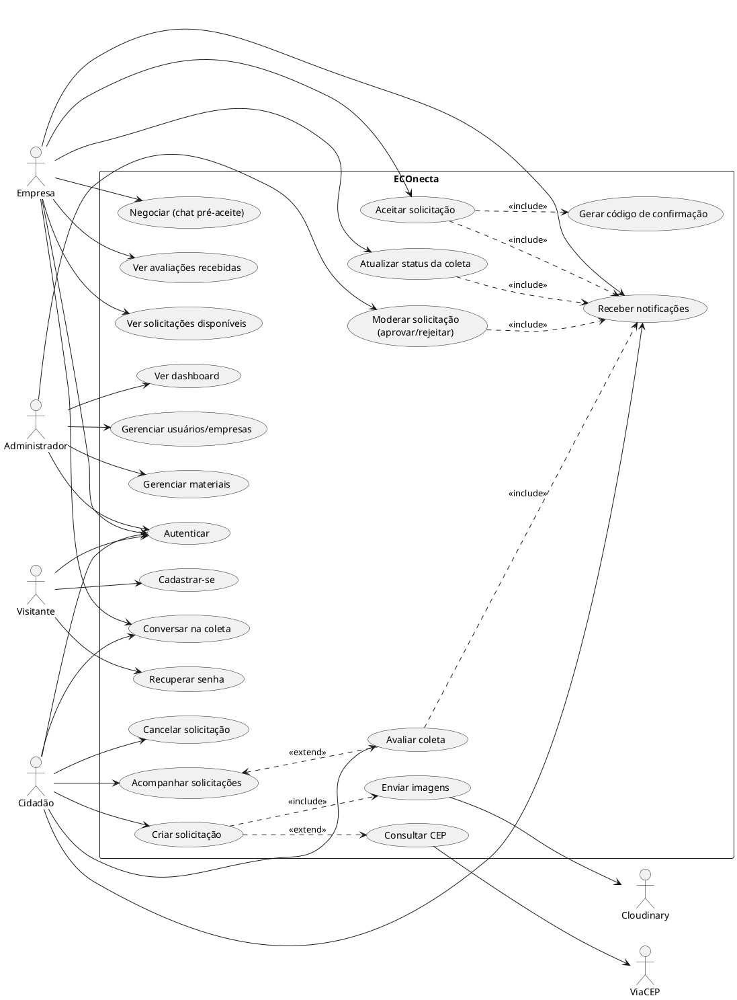

**Públicos vs. autenticados**: UC1–UC3 são públicos; todos os demais exigem sessão. **Por permissão**: UC20–UC23 (admin), UC30–UC35 (empresa), UC10/UC13–UC15 (cidadão). **Operacionais**: UC32/UC34/UC40. **Administrativos**: UC20–UC23.

---

## 8. Diagrama de Classes

**Objetivo**: representar os modelos de domínio (Prisma) e as principais classes de serviço/infra.

**Explicação**: os *models* Prisma formam o núcleo de domínio; os *services* são módulos funcionais (não classes OO, mas agrupados como `<<service>>`) que orquestram regras; `route-guard` e `mobile-auth` formam a camada de segurança. As cardinalidades seguem o `schema.prisma`.

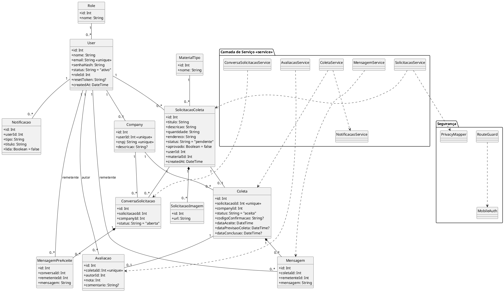

---

## 9. Diagrama de Entidades / Modelo de Domínio

**Objetivo**: representar o banco PostgreSQL conforme `schema.prisma` (nomes físicos das tabelas via `@@map`).

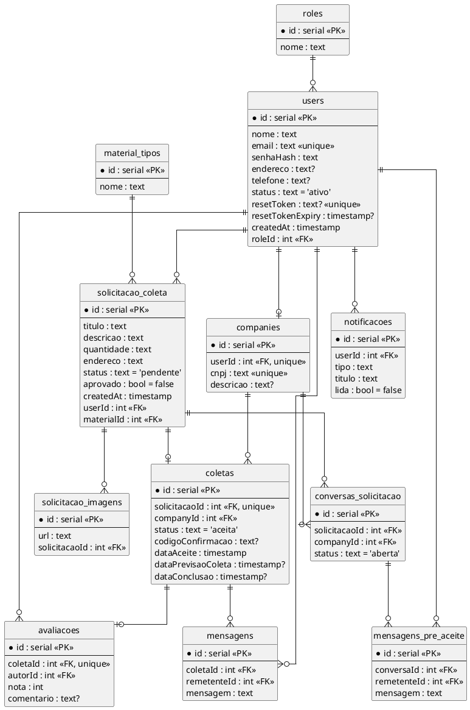

**Pontos críticos / inconsistências encontradas**:
- Campos de **status** são `String` livres (não `enum` do Postgres). A consistência é garantida só na aplicação (Zod). **Risco de dados inconsistentes** se houver escrita fora dos services. → ver RN e Melhorias.
- `ConversaSolicitacao.status` aceita `aberta|convertida|encerrada`, valores **não centralizados** em `packages/shared/status.ts` (estão só no código do service). **[inconsistência de catálogo]**.
- Não há `ON DELETE CASCADE` explícito nas migrations; exclusões dependem da aplicação. **[inferido]**
- `notificacoes` tem índices `(userId, lida)` e `(userId, id)` — otimizados para o stream SSE.

---

## 10. Diagramas de Sequência

### 10.1 Login (web — NextAuth)

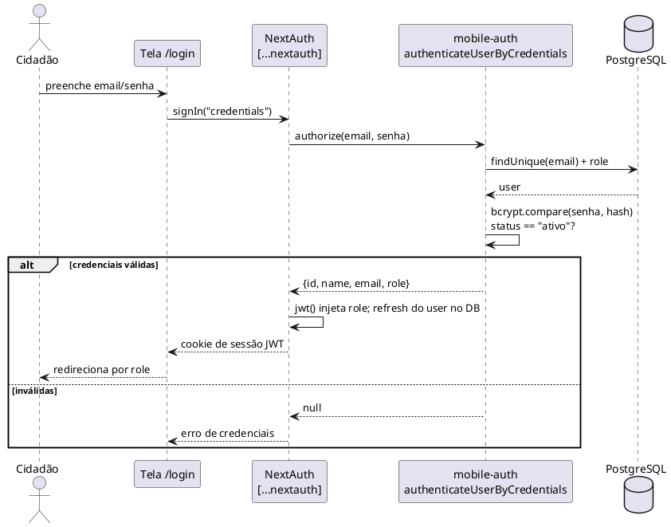

### 10.2 Login mobile (JWT próprio)

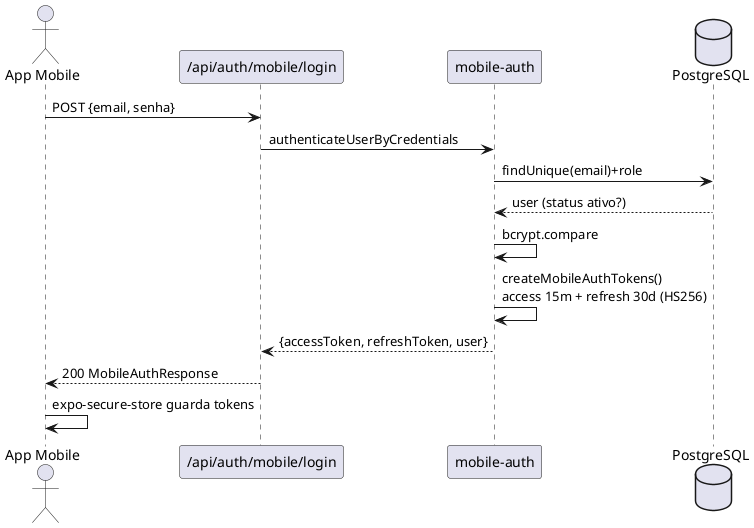

### 10.3 Criar solicitação (com upload)

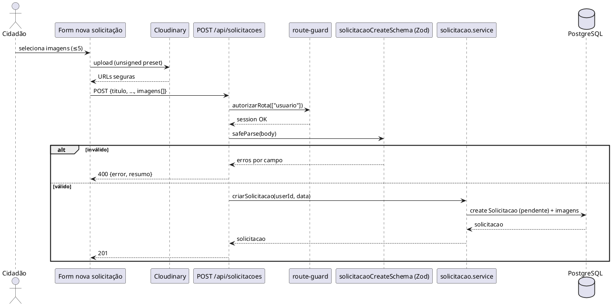

### 10.4 Moderação pelo admin

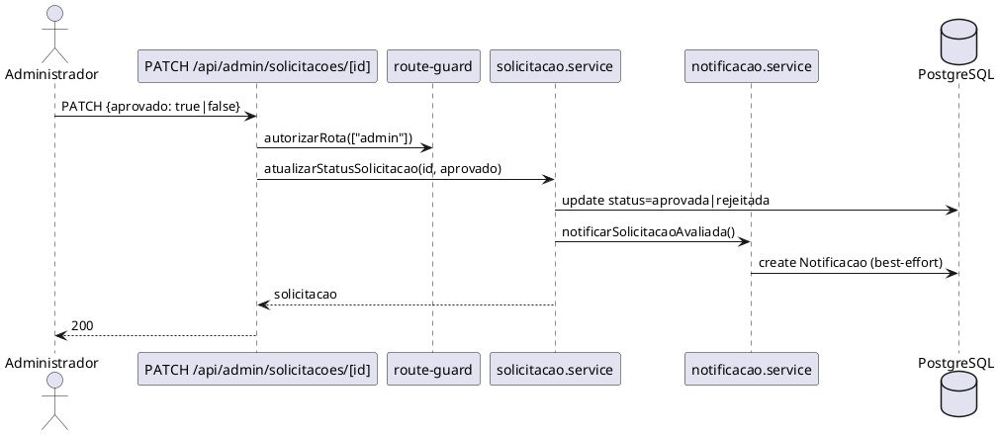

### 10.5 Aceitar solicitação (fluxo principal — transação)

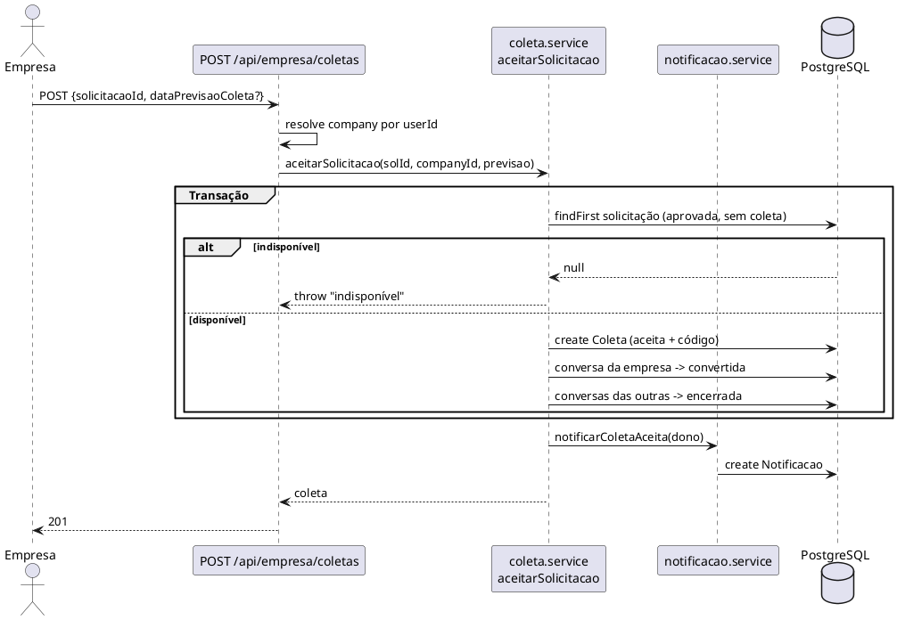

### 10.6 Atualizar status / concluir coleta

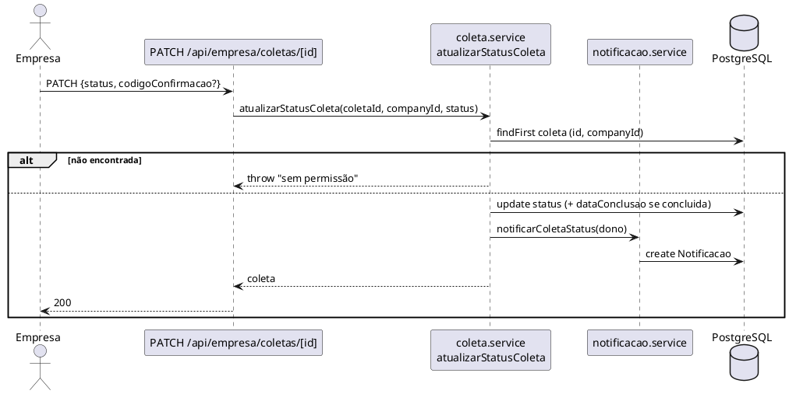

### 10.7 Avaliar coleta concluída

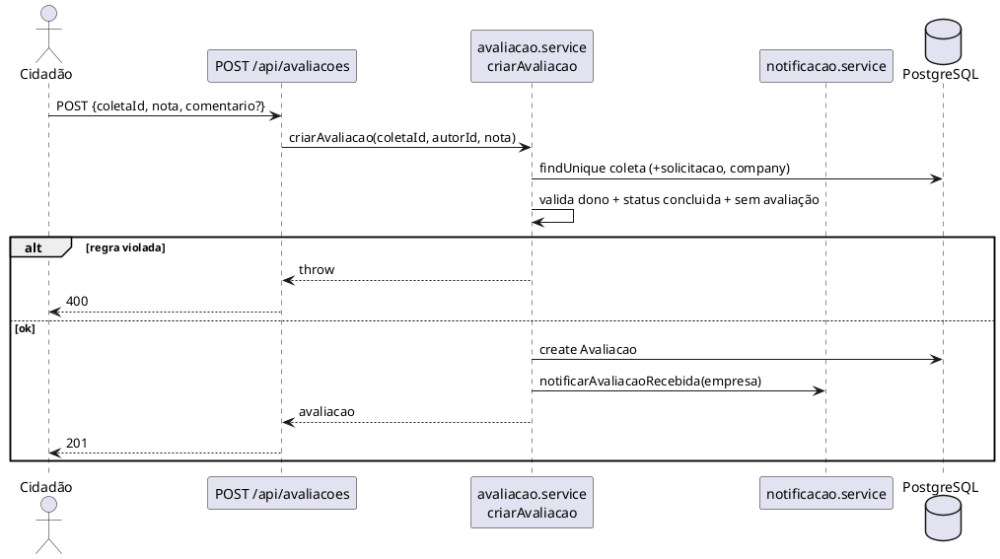

### 10.8 Notificações em tempo real (SSE)

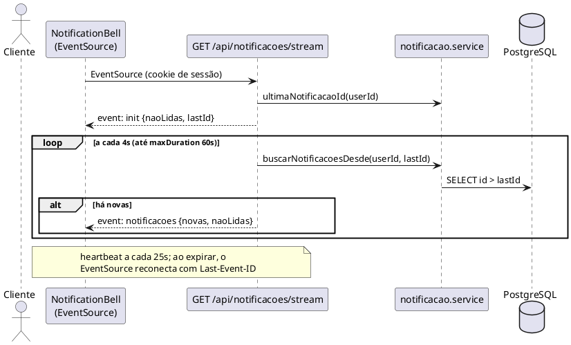

### 10.9 Consulta de CEP (integração externa)

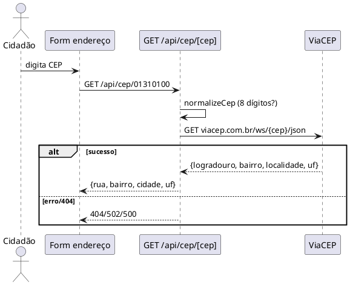

---

## 11. Diagramas de Atividades

### 11.1 Fluxo macro (solicitação → coleta → avaliação)

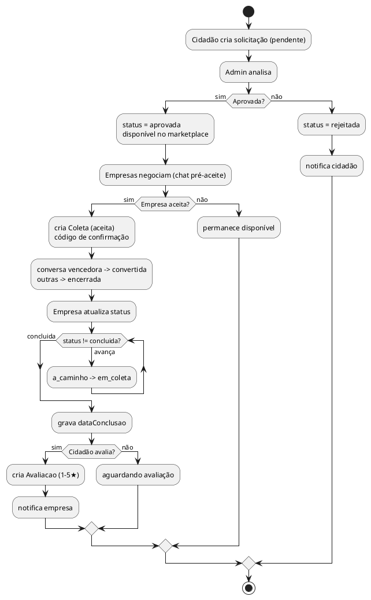

### 11.2 Fluxo de autenticação (web)

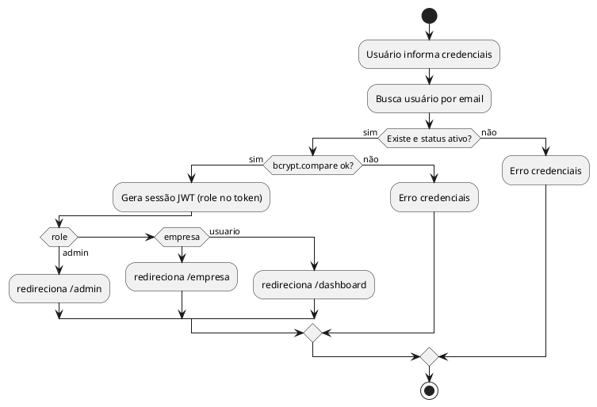

### 11.3 Fluxo de cancelamento de solicitação

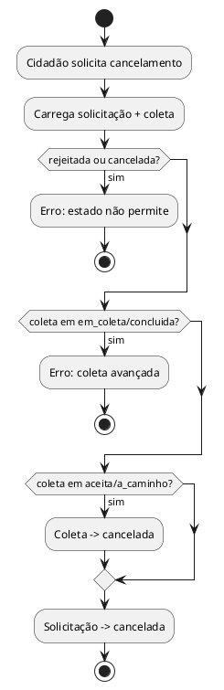

---

## 12. Diagramas de Estados

### 12.1 SolicitacaoColeta

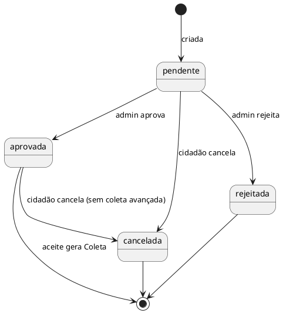

### 12.2 Coleta

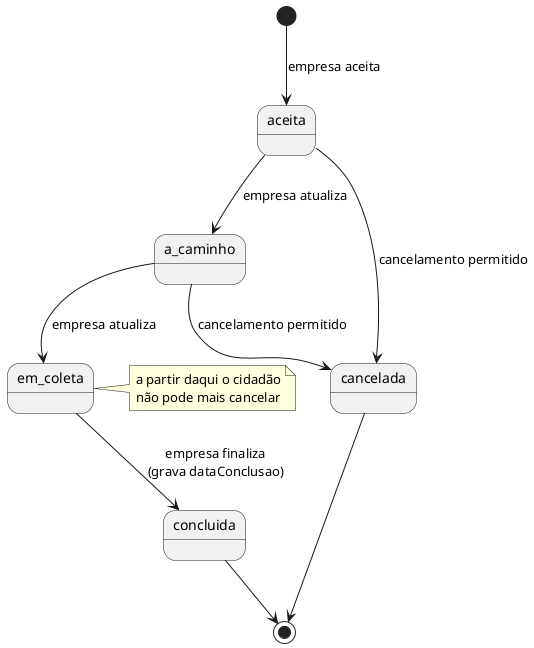

### 12.3 ConversaSolicitacao

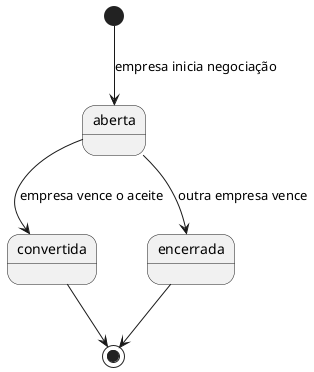

> **Nota**: `Avaliacao`, `Mensagem`, `Notificacao` não possuem ciclo de vida multi-estado relevante (apenas `Notificacao.lida: bool` — transição única `não lida → lida`).

---

## 13. Diagrama de Componentes

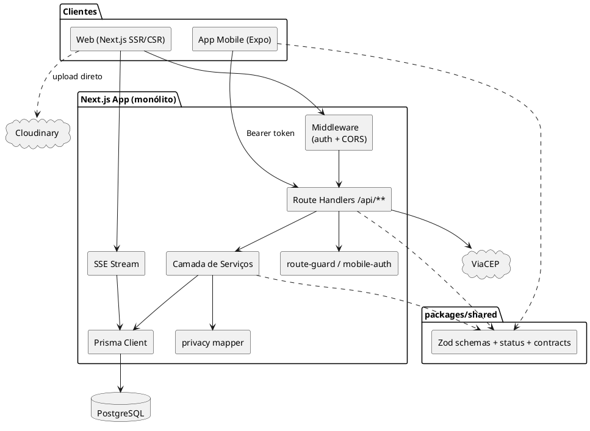

**Responsabilidades**: `Middleware` faz autorização de páginas e CORS de API; `Route Handlers` são a fronteira HTTP; `Serviços` concentram regras; `route-guard/mobile-auth` unificam sessão web e Bearer mobile; `privacy mapper` aplica mascaramento; `Prisma` é a persistência; `SSE` empurra notificações. **Acoplamentos**: handlers dependem fortemente dos services (bom); alguns handlers acessam `prisma` diretamente (ex.: `empresa/coletas`) — acoplamento que poderia migrar para o service.

---

## 14. Diagrama de Pacotes

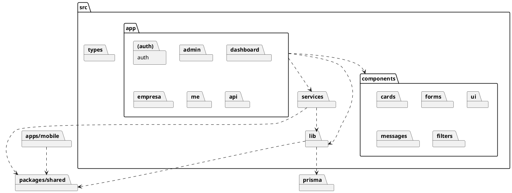

**Responsabilidades**: `app/` rotas e telas (App Router); `services/` regras de negócio; `lib/` infra (auth, prisma, privacy, cors, route-guard); `components/` UI reutilizável; `packages/shared` contratos comuns web+mobile; `prisma/` schema, migrations e seed.

**Problema de organização**: domínios estão **espalhados** entre `app/`, `services/` e `components/` por tipo, não por feature. Sugere-se evolução para *feature folders* (ver Melhorias).

---

## 15. Diagrama de Implantação / Deploy

> **[deploy inferido]** — não há `Dockerfile`, `docker-compose` nem `vercel.json`/`vercel.ts` no repositório. A stack (Next.js + Prisma + Postgres com connection string no formato Neon, e Cloudinary) aponta fortemente para **Vercel + Postgres gerenciado**.

```plantuml
@startuml deploy-econecta
node "Dispositivo do usuário" {
  artifact "Navegador" as B
  artifact "App Expo (iOS/Android)" as A
}
node "Vercel [inferido]" {
  artifact "Next.js (SSR + Route Handlers + SSE)" as NX
  artifact "Variáveis de ambiente\n(NEXTAUTH_SECRET, DATABASE_URL, ...)" as ENV
}
node "Postgres gerenciado\n(Neon) [inferido]" {
  database "PostgreSQL" as DB
}
cloud "Cloudinary" as CL
cloud "ViaCEP" as CEP

B --> NX : HTTPS / SSE
A --> NX : HTTPS (Bearer JWT)
B --> CL : upload de imagens (HTTPS)
NX --> DB : Prisma (TLS, sslmode=require)
NX --> CEP : HTTPS
NX ..> ENV
@enduml
```

**Camadas de segurança presentes**: headers de segurança (`next.config.js`: `X-Frame-Options`, `nosniff`, etc.), CORS (`lib/cors.ts`), TLS no banco (`sslmode=require`), hash bcrypt, JWT assinado. **Volumes/CI-CD**: não identificados no repositório.

---

## 16. Documentação de Rotas e Endpoints

### 16.1 Páginas (App Router)

| Rota | Acesso | Objetivo |
|------|--------|----------|
| `/` | Público | Landing page |
| `/login`, `/register` | Público | Autenticação/cadastro |
| `/forgot-password`, `/reset-password` | Público | Recuperação de senha |
| `/dashboard` | usuario | Painel do cidadão |
| `/dashboard/solicitacoes` `/nova` `/[id]` | usuario | Listar/criar/detalhar solicitações |
| `/dashboard/mensagens` | usuario | Caixa de mensagens |
| `/admin` | admin | Dashboard analítico |
| `/admin/solicitacoes` `/[id]` | admin | Moderação |
| `/admin/usuarios` `/empresas` `/materiais` | admin | CRUD |
| `/empresa` | empresa | Painel da empresa |
| `/empresa/solicitacoes` | empresa | Marketplace |
| `/empresa/coletas` `/[id]` | empresa | Coletas e atualização |
| `/empresa/solicitacoes/[id]/conversa` | empresa | Chat pré-aceite |
| `/empresa/avaliacoes` `/mensagens` | empresa | Reputação e mensagens |
| `/me` | autenticado | Perfil |

### 16.2 Endpoints da API (principais)

| Método | Caminho | Auth (role) | Descrição | Service |
|--------|---------|-------------|-----------|---------|
| POST | `/api/auth/register` | público | Cadastro | mobile-auth/register |
| GET | `/api/auth/check-email` | público | Verifica e-mail | — |
| POST | `/api/auth/[...nextauth]` | público | Login web | lib/auth |
| POST | `/api/auth/mobile/login` | público | Login mobile | mobile-auth |
| POST | `/api/auth/mobile/refresh` | público | Refresh token | mobile-auth |
| POST | `/api/auth/forgot-password` | público | Gera reset token | — |
| POST | `/api/auth/reset-password` | público | Redefine senha | — |
| GET/PATCH | `/api/users/me` | autenticado | Perfil | — |
| GET | `/api/solicitacoes` | usuario/admin/empresa | Lista (ramifica por role) | solicitacao |
| POST | `/api/solicitacoes` | usuario | Cria | solicitacao |
| GET | `/api/solicitacoes/[id]` | autenticado | Detalha | solicitacao |
| DELETE/PATCH | `/api/solicitacoes/[id]` | usuario | Cancela | solicitacao |
| GET | `/api/solicitacoes/[id]/conversas` | usuario | Conversas pré-aceite | conversa-solicitacao |
| PATCH | `/api/admin/solicitacoes/[id]` | admin | Aprova/rejeita | solicitacao |
| GET | `/api/admin/dashboard` | admin | Estatísticas | — |
| GET/POST/PATCH/DELETE | `/api/admin/users\|companies\|materiais` | admin | CRUD | — |
| GET | `/api/empresa/coletas` | empresa | Lista coletas | coleta |
| POST | `/api/empresa/coletas` | empresa | Aceita solicitação | coleta |
| GET/PATCH | `/api/empresa/coletas/[id]` | empresa | Detalha/atualiza status | coleta |
| GET | `/api/empresa/solicitacoes/[id]/conversa` | empresa | Conversa pré-aceite | conversa-solicitacao |
| GET/POST | `/api/mensagens/[id]` | participantes | Mensagens da coleta | mensagem |
| GET | `/api/mensagens/inbox` | autenticado | Caixa de entrada | mensagens-inbox |
| POST | `/api/conversas-solicitacao/[id]/mensagens` | participantes | Mensagem pré-aceite | conversa-solicitacao |
| POST | `/api/avaliacoes` | usuario | Avalia coleta | avaliacao |
| GET | `/api/avaliacoes/coleta/[coletaId]` | autenticado | Avaliação da coleta | avaliacao |
| GET | `/api/avaliacoes/empresa/[companyId]` | autenticado | Média da empresa | avaliacao |
| GET | `/api/materiais` | autenticado | Lista materiais | — |
| GET | `/api/cep/[cep]` | público | Consulta ViaCEP | — |
| GET | `/api/notificacoes` | autenticado | Lista | notificacao |
| PATCH | `/api/notificacoes/[id]` | autenticado | Marca lida | notificacao |
| GET | `/api/notificacoes/stream` | autenticado | SSE | notificacao |

**Status HTTP comuns**: 200/201 sucesso · 400 validação · 401 não autenticado · 403 acesso negado · 404 não encontrado · 500 erro interno · 502 (ViaCEP indisponível).

---

## 17. Documentação das Telas (resumo)

| Tela | Rota | Perfil | APIs consumidas | Ações |
|------|------|--------|-----------------|-------|
| Landing | `/` | público | — | navegar p/ login/registro |
| Login | `/login` | público | NextAuth | autenticar |
| Registro | `/register` | público | `register`, `check-email`, `cep` | cadastrar |
| Painel cidadão | `/dashboard` | usuario | `solicitacoes` | visão geral |
| Nova solicitação | `/dashboard/solicitacoes/nova` | usuario | Cloudinary, `cep`, `materiais`, `solicitacoes` | criar, upload |
| Detalhe solicitação | `/dashboard/solicitacoes/[id]` | usuario | `solicitacoes/[id]`, `conversas`, `avaliacoes` | cancelar, conversar, avaliar |
| Painel admin | `/admin` | admin | `admin/dashboard` | KPIs e gráficos |
| Moderação | `/admin/solicitacoes/[id]` | admin | `admin/solicitacoes/[id]` | aprovar/rejeitar |
| Painel empresa | `/empresa` | empresa | `empresa/coletas` | visão geral |
| Marketplace | `/empresa/solicitacoes` | empresa | `solicitacoes`, conversa | negociar, aceitar |
| Coleta (detalhe) | `/empresa/coletas/[id]` | empresa | `empresa/coletas/[id]`, `mensagens` | atualizar status, chat |
| Avaliações | `/empresa/avaliacoes` | empresa | `avaliacoes/empresa` | ver reputação |
| Perfil | `/me` | autenticado | `users/me` | editar dados |

**Estados de carregamento/erro**: o projeto usa `loading.tsx` por segmento (App Router) e `ErrorBoundary.tsx`; chat e SSE têm reconexão automática.

---

## 18. Análise de Qualidade da Arquitetura

| Aspecto | Classificação | Observação |
|---------|---------------|------------|
| Organização de pastas | **Atenção** | Por tipo, não por feature; cresce com acoplamento horizontal. |
| Separação de responsabilidades | **Bom** | Camada de serviços bem definida; handlers finos na maioria. |
| Acoplamento | **Atenção** | Alguns handlers acessam Prisma direto (ex.: `empresa/coletas`). |
| Coesão | **Bom** | Services coesos por domínio. |
| Reutilização (shared) | **Bom** | `packages/shared` evita duplicar validação web/mobile. |
| Tratamento de erros | **Atenção** | `throw new Error(string)` genérico; status inferido no handler; mensagens vazam para o cliente em alguns 500. |
| Validação de dados | **Bom** | Zod consistente; dupla validação em imagens. |
| Segurança (autenticação) | **Bom** | bcrypt(12), JWT assinado, dois fluxos (web/mobile). |
| Autorização | **Bom** | Dupla camada (middleware + route-guard) e checagem de ownership nos services. |
| Privacidade | **Bom** | Mascaramento explícito antes do aceite. |
| Tempo real | **Atenção** | SSE por *polling* a cada 4s (custo de DB); aceitável na escala atual. |
| Testabilidade | **Bom (parcial)** | Há testes (`*.service.test.ts`, `validations.test.ts`, vitest) — cobrindo services-chave. |
| Escalabilidade | **Atenção** | SSE + polling e `force-dynamic` em tudo limitam cache/escala horizontal. |
| Consistência de status | **Crítico (leve)** | Status como `String` no banco; `ConversaSolicitacao` fora do catálogo `shared/status`. |
| Integridade referencial | **Atenção** | Sem `onDelete` explícito; deleção depende da app. |
| Qualidade dos models | **Bom** | Schema claro, `@@unique`, índices em `notificacoes`. |
| Segredo de tokens | **Atenção** | `MOBILE_AUTH_SECRET` cai para `NEXTAUTH_SECRET` — aceitável, mas documentar. |

---

## 19. Sugestões de Melhoria

### Alta prioridade
1. **Converter status em `enum` Postgres (ou CHECK)** e centralizar `ConversaSolicitacao` em `packages/shared/status.ts`.
   - *Problema*: status livres como `String` permitem valores inválidos. *Impacto*: integridade. *Arquivos*: `schema.prisma`, `packages/shared/src/status.ts`. *Risco*: médio (migration).
2. **Padronizar erros de domínio** com classe/`code` e mapear para HTTP no handler (evitar vazar `err.message` em 500).
   - *Arquivos*: `services/*`, handlers `api/**`. *Risco*: baixo.
3. **Definir política de exclusão (`onDelete`)** nas relações para evitar registros órfãos.
   - *Arquivos*: `schema.prisma` + migration. *Risco*: médio.

### Média prioridade
4. **Reorganizar por feature** (`features/solicitacao`, `features/coleta`…) agrupando rota+service+componentes. *Risco*: médio (refactor amplo).
5. **Mover acesso direto ao Prisma dos handlers para os services** (ex.: `empresa/coletas`). *Risco*: baixo.
6. **Avaliar Postgres `LISTEN/NOTIFY` ou fila** para o stream em vez de polling 4s. *Risco*: médio.
7. **Documentar variáveis de ambiente** com um `.env.example` versionado (hoje só citado no README). *Risco*: baixo.

### Baixa prioridade
8. **Adicionar `vercel.ts`** para configuração explícita de build/headers/crons. *Risco*: baixo.
9. **Ampliar cobertura de testes** para handlers e fluxo de avaliação/cancelamento. *Risco*: baixo.
10. **OpenAPI/Swagger completo** — já há `swagger-jsdoc`/`swagger-ui-react` nas deps; documentar todos os endpoints. *Risco*: baixo.

---

## 20. Base do conteúdo: código vs. inferência

**Diretamente do código** (alta confiança):
- Stack, dependências, scripts — `package.json`.
- Modelo de dados e relações — `prisma/schema.prisma` + migrations.
- Status e validações — `packages/shared/src/{status,validations,contracts}.ts`.
- Regras de negócio e fluxos — `src/services/*.ts`, handlers `src/app/api/**`.
- Autenticação/autorização — `src/lib/{auth,mobile-auth,route-guard}.ts`, `src/middleware.ts`.
- Privacidade — `src/lib/privacy.ts`. Notificações/SSE — `notificacao.service.ts`, `/stream`.
- Integrações — Cloudinary (`next-cloudinary`, README) e ViaCEP (`api/cep/[cep]`).
- Atores e papéis — `prisma/seed.ts`, README, `docs/` (apêndices existentes).

**Inferido** (marcado no texto):
- **Deploy** (Vercel + Neon): inferido pela stack e connection string; sem `Dockerfile`/`vercel.*` no repo.
- **Envio de e-mail** na recuperação de senha: a API retorna `resetLink`; não há provedor SMTP configurado.
- Ausência de `ON DELETE CASCADE`: inferido das migrations.

**Não identificado**:
- Pagamentos, rastreamento GPS em tempo real, push nativo no mobile, CI/CD, auto-cadastro de admin.
